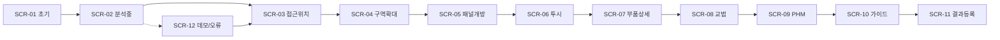

# 04. 화면정의서

기존 프로토타입 One-Screen(`/assistant`)을 유지·확장한다. 다페이지(현황·교범 등)는 시연 CTA로만 선택 지원하고, **주 시연은 단일 화면 + 하단 탭**이다.

## 화면 흐름



## ASCII Wireframe (공통)

```text
┌─ Header: AI 정비 어시스턴트 | DEMO-KUH-01 | Demo ON/OFF | Reset ─┐
├────────────┬──────────────────────────┬─────────────────────────┤
│ AIQuery    │ AircraftViewer (3D)      │ DiagnosisPanel          │
│ 채팅       │ 전체→구역→패널→부품       │ 계통/위험/부품/근거      │
│ 입력창     │                          │                         │
├────────────┴──────────────────────────┴─────────────────────────┤
│ Tabs: 교범 | 유사고장 | PHM | 정비가이드 | 정비이력 | DemoCtrl   │
└─────────────────────────────────────────────────────────────────┘
```

---

## SCR-01 초기 화면

| 항목 | 내용 |
|---|---|
| 화면 ID | SCR-01 |
| 목적 | 질의 대기, 전체 기체 표시 |
| UI 영역 | 3열 + 하단 탭(비활성/빈 상태) |
| 사용자 입력 | 텍스트 입력, Demo 토글 |
| 시스템 처리 | GLB 로드, 초기 카메라 |
| 출력 | 항공기 전체, 더미 고지 |
| 버튼/이벤트 | 전송, Reset |
| 3D 상태 | viewLevel=`AIRCRAFT`, highlight=[] |
| API | 없음(또는 health) |
| 예외 | GLB 실패 → 오류 배너 + PNG 폴백 옵션 |
| 다음 | SCR-02 |

## SCR-02 AI 질의 분석 중

| 항목 | 내용 |
|---|---|
| 화면 ID | SCR-02 |
| 목적 | 로딩/분석 피드백 |
| 입력 | 질의 전송 직후 |
| 처리 | POST /api/query |
| 출력 | 스피너, “계통 분류 중…” |
| 3D | 유지(초기) |
| API | POST /api/query |
| 예외 | timeout → 데모 fallback (SCR-12) |
| 다음 | SCR-03 |

## SCR-03 접근 위치 표시

| 항목 | 내용 |
|---|---|
| 화면 ID | SCR-03 |
| 목적 | 엔진 구역 표시 |
| 입력 | DiagnosisResult |
| 처리 | view_target_id=`ENGINE_OIL_SYSTEM` 적용(하이라이트만 또는 약확대) |
| 출력 | 우측 계통/위험 HIGH, 좌측 AI 답변 |
| 버튼 | “상세 위치 보기” / 구역 클릭 |
| 3D | highlight ENGINE_ZONE/PANEL, Html 라벨 |
| API | GET /api/3d/map/ENGINE_OIL_SYSTEM |
| 다음 | SCR-04 |

## SCR-04 계통 구역 확대

| 항목 | 내용 |
|---|---|
| 화면 ID | SCR-04 |
| 목적 | 카메라 자동 이동 |
| 입력 | 구역 클릭 |
| 처리 | GSAP camera → SYSTEM preset |
| 출력 | 접근패널 강조 |
| 버튼 | 패널 열기 / 내부 보기 |
| 3D | viewLevel=`SYSTEM` |
| 다음 | SCR-05 |

## SCR-05 접근패널 개방

| 항목 | 내용 |
|---|---|
| 화면 ID | SCR-05 |
| 목적 | ENGINE_PANEL_LEFT/RIGHT hide 또는 이동 |
| 처리 | openedPanels 갱신 |
| 3D | 패널 비표시, 내부 ENGINE_BLOCK 노출 시작 |
| 다음 | SCR-06 |

## SCR-06 내부 부품 투시

| 항목 | 내용 |
|---|---|
| 화면 ID | SCR-06 |
| 목적 | 외피 투명화 + 내부 부품 |
| 처리 | xrayMode=true, transparentObjects |
| 출력 | OIL_FILTER/PUMP/SENSOR 가시 |
| 3D | AIRCRAFT_BODY opacity 0.2~0.35 |
| 다음 | SCR-07 |

## SCR-07 부품 상세

| 항목 | 내용 |
|---|---|
| 화면 ID | SCR-07 |
| 목적 | OIL_FILTER 중심 확대 |
| 입력 | 부품 클릭 또는 가이드 단계 |
| 처리 | view_target_id=`ENGINE_OIL_FILTER` |
| 출력 | 하이라이트 + 점검 사유 |
| API | GET /api/3d/map/ENGINE_OIL_FILTER |
| 다음 | SCR-08/SCR-10 |

## SCR-08 교범 원문 확인

| 항목 | 내용 |
|---|---|
| 화면 ID | SCR-08 |
| 목적 | 더미 교범 장·절·페이지·발췌 |
| 입력 | manual 탭 / 검색 |
| API | GET /api/manual/search |
| 출력 | is_dummy=true 배지 |
| 예외 | 근거 없음 → “교범 근거 부족” 메시지 |
| 다음 | SCR-09 |

## SCR-09 PHM 확인

| 항목 | 내용 |
|---|---|
| 화면 ID | SCR-09 |
| 목적 | 모의 센서 확인 |
| API | GET /api/phm/DEMO-KUH-01 |
| 출력 | 28psi, 필터차압 12psi 등 + 모의 고지 |
| 다음 | SCR-10 |

## SCR-10 정비 가이드 진행

| 항목 | 내용 |
|---|---|
| 화면 ID | SCR-10 |
| 목적 | recommended_steps 단계 진행 |
| 입력 | 단계 클릭 |
| 처리 | step → viewTarget 매핑 |
| 3D | 단계별 장면 동기화 |
| 다음 | SCR-11 |

## SCR-11 정비결과 등록

| 항목 | 내용 |
|---|---|
| 화면 ID | SCR-11 |
| 목적 | 조치 결과 저장 |
| 입력 | 조치내용, 사용부품 |
| API | POST /api/maintenance/result |
| 다음 | SCR-01(리셋) 또는 이력 탭 |

## SCR-12 데모모드 및 오류

| 항목 | 내용 |
|---|---|
| 화면 ID | SCR-12 |
| 목적 | API 실패·데모 강제 |
| 입력 | Demo ON 또는 자동 fallback |
| 처리 | demoResponses 키워드 매칭 |
| 출력 | is_demo=true, 배너 “데모 고정 응답” |
| API | 로컬 JSON / POST /api/demo/reset |
| 다음 | SCR-03와 동일 경로 |

---

## 상태별 3D 매핑 요약

| 화면 | view_target_id | viewLevel |
|---|---|---|
| SCR-01 | `AIRCRAFT_OVERVIEW` | AIRCRAFT |
| SCR-03~04 | `ENGINE_OIL_SYSTEM` | SYSTEM |
| SCR-05~06 | `ENGINE_OIL_SYSTEM` + panel/xray | SYSTEM |
| SCR-07 | `ENGINE_OIL_FILTER` | COMPONENT |
