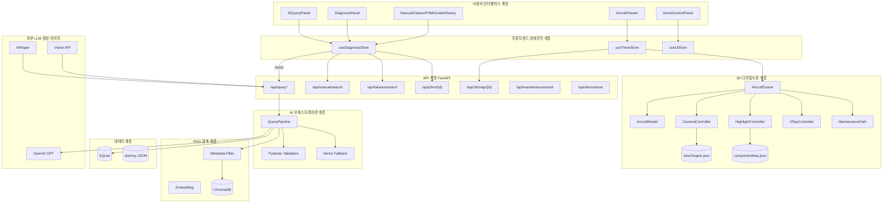
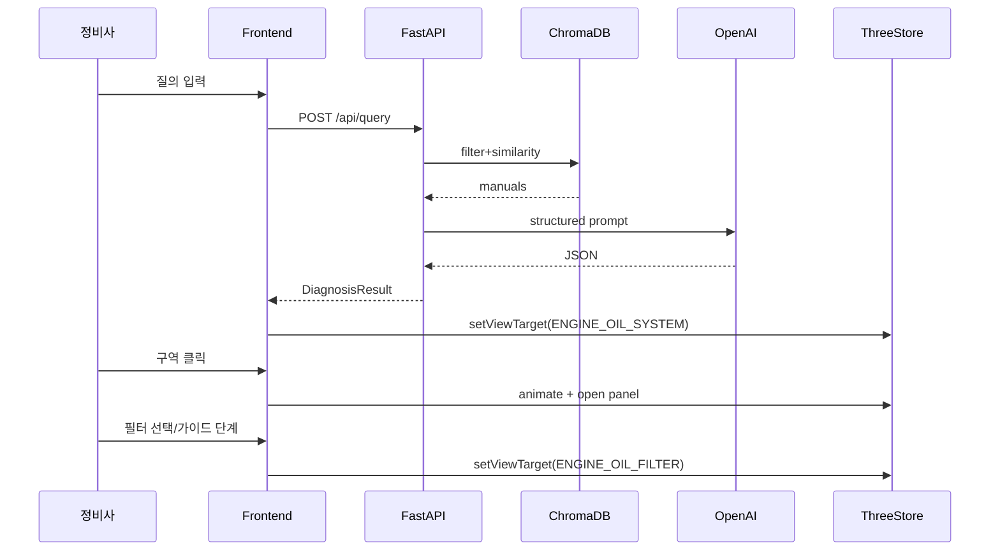

# 05. 시스템 아키텍처

## 1. 전체 다이어그램

## 2. 계층별 상세

### 2.1 사용자 인터페이스 계층

| 항목 | 내용 |
|---|---|
| 기술 | React, Tailwind |
| 기능 | 질의·결과·탭·데모 제어 |
| 입력 | 사용자 이벤트 |
| 출력 | 화면 렌더 |
| 컴포넌트 | AIQueryPanel, DiagnosisPanel, Bottom tabs, DemoControlPanel |
| 연결 | Zustand store 구독 |
| 오류 | 토스트/배너 |
| 더미 | 채팅 플레이스홀더 |
| 실개발 | 전체 UI 신규(프로토타입 패턴 이관) |

### 2.2 3D 디지털트윈 계층

| 항목 | 내용 |
|---|---|
| 기술 | Three.js, R3F, Drei, GSAP |
| 기능 | 로드, 클릭, 카메라, 하이라이트, X-Ray, 패널 |
| 입력 | viewTargetId, raycast hit |
| 출력 | 장면 상태 |
| 컴포넌트 | AircraftScene/Model/Controllers |
| 연결 | useThreeStore ↔ viewTargets.json |
| 오류 | 로딩 실패 UI |
| 더미 | 박스 프록시 메시 |
| 실개발 | GLB·컨트롤러 |

### 2.3 프론트엔드 상태관리 계층

| 항목 | 내용 |
|---|---|
| 기술 | Zustand |
| 기능 | diagnosis, three, ui 동기화 |
| 입력 | API 응답, UI 이벤트 |
| 출력 | 구독 컴포넌트 갱신 |
| 연결 | services/* → stores |
| 오류 | error 필드 |
| 더미 | isDemo 플래그 |
| 실개발 | store 설계 필수 |

### 2.4 API 계층

| 항목 | 내용 |
|---|---|
| 기술 | FastAPI, Pydantic |
| 기능 | REST 엔드포인트 |
| 입력 | HTTP request |
| 출력 | JSON |
| 연결 | Orchestration / Data |
| 오류 | HTTP 4xx/5xx + detail |
| 더미 | demo reset, 고정 응답 |
| 실개발 | 전 API |

### 2.5 AI 오케스트레이션 계층

| 항목 | 내용 |
|---|---|
| 기술 | Python 서비스 |
| 기능 | 분류→검색→생성→검증→fallback |
| 입력 | query text |
| 출력 | DiagnosisResult |
| 오류 | LLM 실패 시 Demo Fallback |
| 더미 | 키워드 규칙 분류기 |
| 실개발 | 파이프라인 |

### 2.6 RAG 검색 계층

| 항목 | 내용 |
|---|---|
| 기술 | ChromaDB, Embedding |
| 기능 | 문단 검색 |
| 입력 | embedding + where filter |
| 출력 | top-k chunks |
| 오류 | 빈 결과 → 근거없음 플래그 |
| 더미 | JSON 키워드 검색 대체 가능 |
| 실개발 | 컬렉션 적재 |

### 2.7 데이터 계층

| 항목 | 내용 |
|---|---|
| 기술 | SQLite + JSON 시드 |
| 기능 | 이력, 마스터, 데모 |
| 오류 | 마이그레이션/시드 스크립트 |
| 더미 | 전체 시드 데이터 |
| 실개발 | 스키마·시드 |

### 2.8 외부 LLM·음성·이미지

| 항목 | 내용 |
|---|---|
| 기술 | OpenAI GPT, Whisper, Vision |
| 기능 | 생성/STT/이미지 |
| 오류 | timeout·401 → fallback |
| 더미 | 전부 데모모드로 대체 가능 |
| 실개발 | 키 있을 때만 실호출 |

## 3. 요청 시퀀스 (대표 시나리오)

