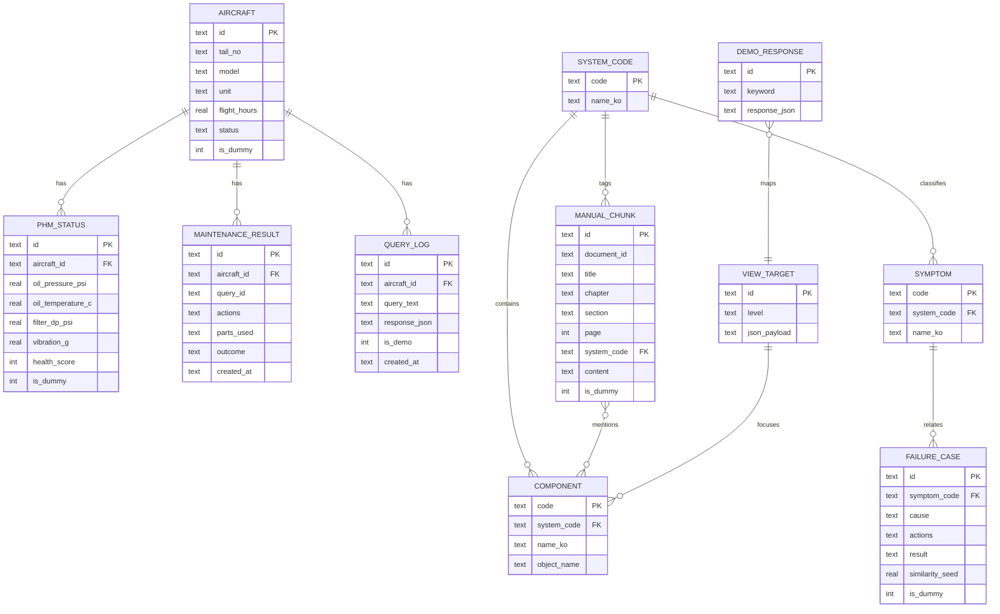

# 09. 데이터 모델

모든 정비·센서·교범 데이터는 **더미**이다. `is_dummy=1/true` 필수.

## 1. SQLite ERD

## 2. 테이블/JSON 필드 정의

### 2.1 항공기 (aircraft)

| 필드 | 타입 | 필수 | 설명 | 샘플 |
|---|---|---|---|---|
| id | TEXT | Y | PK | DEMO-KUH-01 |
| tail_no | TEXT | Y | 표시 테일 | Surion-KUH-01 |
| model | TEXT | Y | 모델 | KUH-1 가상시연 |
| unit | TEXT | N | 부대 | 해병 정비대대 A |
| flight_hours | REAL | N | FH | 1842 |
| status | TEXT | Y | 정상/주의/이상 | 이상 |
| is_dummy | INT | Y | 더미 | 1 |

### 2.2 계통 (system)

| 필드 | 타입 | 필수 | 샘플 |
|---|---|---|---|
| code | TEXT PK | Y | ENGINE_OIL |
| name_ko | TEXT | Y | 엔진 오일계통 |

### 2.3 부품 (component)

| 필드 | 타입 | 필수 | 샘플 |
|---|---|---|---|
| code | TEXT PK | Y | OIL_FILTER |
| system_code | TEXT FK | Y | ENGINE_OIL |
| name_ko | TEXT | Y | 오일 필터 |
| object_name | TEXT | Y | OIL_FILTER |

### 2.4 증상 (symptom)

| 필드 | 타입 | 필수 | 샘플 |
|---|---|---|---|
| code | TEXT PK | Y | LOW_OIL_PRESSURE |
| system_code | TEXT | Y | ENGINE_OIL |
| name_ko | TEXT | Y | 오일 압력 저하 |

### 2.5 더미 교범 (manual_chunk)

| 필드 | 타입 | 필수 | 샘플 |
|---|---|---|---|
| id | TEXT PK | Y | DUMMY-TM-ENG-03-P15 |
| document_id | TEXT | Y | DUMMY-TM-ENG-03 |
| title | TEXT | Y | 엔진 오일 압력 저하 점검 |
| chapter | TEXT | Y | 3 |
| section | TEXT | Y | 2 |
| page | INT | Y | 15 |
| system_code | TEXT | Y | ENGINE_OIL |
| symptom_codes | TEXT/JSON | Y | ["LOW_OIL_PRESSURE"] |
| component_codes | TEXT/JSON | Y | ["OIL_FILTER"] |
| content | TEXT | Y | (점검 문단) |
| is_dummy | INT | Y | 1 |

### 2.6 유사 고장사례

| 필드 | 타입 | 필수 | 샘플 |
|---|---|---|---|
| id | TEXT | Y | C-2023-081 |
| symptom_code | TEXT | Y | LOW_OIL_PRESSURE |
| cause | TEXT | Y | 오일 필터 막힘(모의) |
| actions | TEXT | Y | 필터 교체… |
| result | TEXT | Y | 압력 회복(모의) |
| similarity_seed | REAL | N | 0.95 |
| is_dummy | INT | Y | 1 |

### 2.7 PHM

| 필드 | 타입 | 필수 | 샘플 |
|---|---|---|---|
| aircraft_id | TEXT | Y | DEMO-KUH-01 |
| oil_pressure_psi | REAL | Y | 28 |
| oil_temperature_c | REAL | Y | 98 |
| filter_differential_pressure_psi | REAL | Y | 12 |
| vibration_g | REAL | Y | 0.42 |
| health_score | INT | Y | 28 |
| degradation_percent | INT | N | 72 |
| estimated_rul_fh | INT | N | 18 |
| is_dummy | INT | Y | 1 |

### 2.8 정비 가이드 / 결과

가이드는 DiagnosisResult.recommended_steps + 프론트 step↔viewTarget 매핑 테이블(JSON)로 관리.

정비결과:

| 필드 | 타입 | 필수 | 샘플 |
|---|---|---|---|
| id | TEXT | Y | MR-001 |
| aircraft_id | TEXT | Y | DEMO-KUH-01 |
| actions | TEXT | Y | 오일 필터 교체 |
| parts_used | TEXT | N | DUMMY-FILTER-01 |
| outcome | TEXT | Y | 압력 회복(모의) |
| created_at | TEXT | Y | ISO8601 |

### 2.9 3D 위치 매핑

`view_targets` 테이블 또는 `viewTargets.json` (FE 우선, API `/api/3d/map`는 동일 JSON 서빙).

### 2.10 데모 고정 응답

| 필드 | 타입 | 필수 | 샘플 |
|---|---|---|---|
| id | TEXT | Y | DEMO-OIL-001 |
| keywords | JSON | Y | ["오일 압력","경고등"] |
| response_json | TEXT | Y | DiagnosisResult |

## 3. 참조 관계 요약

- COMPONENT.system_code → SYSTEM_CODE.code
- MANUAL/ FAILURE → SYMPTOM/SYSTEM
- VIEW_TARGET.id ← DiagnosisResult.view_target_id
- componentMap.object_name ↔ Blender mesh name ↔ COMPONENT.object_name
