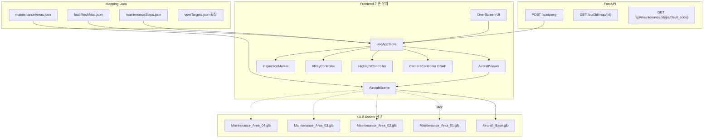

# 16. 3D 정비 시각화 구현전략

> 대상: AI 기반 항공기 정비 어시스턴트 시제품 (`2차 프로토타입`)  
> 기준일: 2026-08-18  
> 원칙: AI는 좌표를 생성하지 않고, 사전 정의 ID(`fault_code` → `area_id` → GLB → mesh → checkpoint)만 반환한다.  
> 실제 군 정비구조·부품번호는 사용하지 않으며 `AREA_01~04` 더미 체계로 범용 설계한다.

---

## 0. 기존 소스 분석 요약 (재사용 vs 신규)

### 0.1 현재 구현 (재사용)

| 자산 | 경로 | 역할 |
|---|---|---|
| One-Screen + R3F Canvas | `AircraftViewer.tsx`, `AircraftScene.tsx` | 중앙 3D 영역 |
| 프록시/GLB 스위치 | `ProxyAircraftModel.tsx`, `GLBAircraftModel.tsx` | 모델 교체 인터페이스 |
| 카메라 GSAP | `CameraController.tsx` + `viewTargets.json` | 프리셋 이동 |
| 하이라이트/투명/패널 | Zustand `highlightedObjects` 등 | opacity·hide·open |
| AI↔3D 연결 | `view_target_id` → `applyViewTarget()` | 진단 결과 연동 |
| 가이드 단계 | `GUIDE_STEPS` in `useAppStore.ts` | 단계↔viewTarget |
| API | FastAPI `/api/query`, `/api/3d/map/{id}` | 구조화 응답 |

### 0.2 기술스택 확정 (충돌 없음 — 유지)

React + Vite + R3F + Drei + GSAP + Zustand + FastAPI + Pydantic.  
Next.js로 되돌리지 않는다. Chroma/LLM은 기존과 동일.

### 0.3 신규 개발 범위

| ID | 신규 항목 | 기존 확장 포인트 |
|---|---|---|
| N1 | `Aircraft_Base.glb` + Area GLB 4개 Lazy Load | `ModelSwitcher` 분리 |
| N2 | `faultMeshMap` / `maintenanceAreas` | `componentMap`·`viewTargets` 상위 계층 |
| N3 | Inspection Point Marker | `ObjectLabel` 확장 |
| N4 | Maintenance Step JSON 엔진 | `GUIDE_STEPS` 하드코딩 → 데이터 구동 |
| N5 | Outline + Emissive 하이라이트 | `HighlightController` 실구현 |
| N6 | Exploded View Transform | `openPanels` 확장 |
| N7 | Area Loading Progress UI | `AircraftViewer` 배너 |

### 0.4 참고 자료 처리

[maily.so ADEX 2021 기사](https://maily.so/sheldon/posts/q5xrxy9lz2v)는 KAI 제품·성능개량 소개이며, **웹 3D 구현 스펙이 아니다**.  
시사점만 반영한다: 방산 전시에서 VR/AR·디지털 정비지원 수요가 언급됨 → 본 시제품은 “정비 위치 안내·투시·점검포인트”에 집중하고, 실제 기체 내부구조를 재현하지 않는다.

---

## 1. 3D 정비 시각화 전체 기술 아키텍처



### 로딩 계층

| 단계 | 로드 | 시점 |
|---|---|---|
| L0 | `Aircraft_Base.glb` (또는 Proxy) | 앱 초기 |
| L1 | Area hotspot 메시(베이스에 포함) | 초기 |
| L2 | `Maintenance_Area_0N.glb` | AREA 진입 / fault 확정 시 |
| L3 | 해제 | 다른 AREA 전환 시 이전 Area dispose(선택) |

### 좌표계·스케일 (공통)

- Blender: **Z-up 제작 → glTF Export 시 Y-up 변환(기본)**  
- 단위: **1 Blender Unit = 1 meter**  
- Base와 Area GLB는 **동일 World Origin** (기체 중심). Area를 Base 자식 좌표에 맞출 것.

---

## 2. Blender / 3D 모델 제작 규격

상세 체크리스트는 [`17_blender_authoring_spec.md`](./17_blender_authoring_spec.md) 참고. 요약:

| 항목 | 규칙 |
|---|---|
| 분리 | 외피 / Cover / 내부부품 / CheckPoint Empty 분리 |
| Naming | `SNAKE_CASE`, ASCII only |
| Area | Collection `AREA_01` … `AREA_04` |
| Cover | `AREA_0N_COVER_*` |
| Part | `AREA_0N_PART_*` |
| CheckPoint | Empty `AREA_0N_CHECK_*` (Display→Sphere) |
| Camera Helper | Empty `AREA_0N_CAM_*` (선택, Export 제외 가능) |
| Material | `MAT_BODY`, `MAT_COVER`, `MAT_PART`, `MAT_GLASS` |
| Origin | 개별 메시 Origin = 기하 중심, Root는 World |
| Export | GLB, Apply Modifiers, +Y Up, 불필요 Camera/Light 제외 |

---

## 3. GLB 파일 및 Asset 구성 규칙

```text
frontend/public/models/
├─ Aircraft_Base.glb              # Low poly 전체 + AREA hotspot
├─ Maintenance_Area_01.glb        # High detail 구역 1
├─ Maintenance_Area_02.glb
├─ Maintenance_Area_03.glb
├─ Maintenance_Area_04.glb
└─ README.md
```

| 파일 | 내용 | 권장 tris | 권장 용량 |
|---|---|---:|---:|
| Aircraft_Base | 외형 + 4개 AREA 외곽/핫스팟 | ≤ 80k | ≤ 5 MB |
| Area_0N | Cover + 내부부품 + CheckPoints | ≤ 120k /개 | ≤ 8 MB /개 |
| 동시 로드 상한 | Base + Area 1개 | ≤ 200k | ≤ 13 MB |

압축: **Draco mesh 압축 필수 권장**, Texture는 **KTX2(BasisU)** 우선(미지원 시 JPEG/WebP 1024).

매니페스트 예: `frontend/src/data/maintenanceAreas.example.json`

---

## 4. Three.js / R3F 구현 기능 명세 (A~H)

각 기능 형식: **기능 → 구현 기술 → 입력 → R3F 처리 → 출력 → Blender 사전작업 → Backend → 예외**

---

### A. 항공기 전체 3D Viewer

| 항목 | 내용 |
|---|---|
| 기능 | Orbit 회전·줌·팬, 4개 AREA 핫스팟 표시 |
| 구현 기술 | `Canvas`, `OrbitControls`, `useGLTF`, `Html` |
| 입력 | `Aircraft_Base.glb`, `maintenanceAreas.json` |
| R3F 처리 | Base 상시 로드. AREA 메시 `emissive`로 idle/active. 클릭 → `selectArea(area_id)` |
| 출력 | 전체 기체 + AREA 라벨 |
| Blender | Base에 `AREA_01_HOTSPOT`~`04` 박스/표면 분리 |
| Backend | 불필요(정적) |
| 예외 | Base 실패 → 기존 `ProxyAircraftModel` fallback |

**기존 연동:** `AircraftScene.ModelSwitcher`를 `BaseModel` + `AreaModelLoader`로 확장. Proxy는 개발/폴백용 유지.

---

### B. 정비 위치 자동 Camera Navigation

| 항목 | 내용 |
|---|---|
| 기능 | fault/area 확정 시 카메라 자동 이동 |
| 구현 기술 | 기존 `CameraController` + GSAP + `viewTargets` |
| 입력 | `view_target_id` 또는 `camera_id` from step |
| R3F 처리 | tween 중 `controls.enabled=false`, 종료 후 재활성. 동일 ID 재진입 스킵 |
| 출력 | AREA 확대 시점 |
| Blender | Empty로 카메라 위치/타겟 측정 후 JSON에 기입 |
| Backend | `/api/3d/map/{view_target_id}` (기존) |
| 예외 | 미등록 ID → `AIRCRAFT_OVERVIEW` |

**카메라 데이터 (구역별):**

```json
{
  "AREA_01_OVERVIEW": {
    "level": "SYSTEM",
    "cameraPosition": [4.5, 2.4, 5.0],
    "cameraTarget": [0.6, 1.7, 0.0],
    "duration": 1.2
  }
}
```

기존 `ENGINE_*` 키는 **AREA_01 시나리오의 alias**로 유지해 하위 호환.

---

### C. Mesh ID Mapping

| 항목 | 내용 |
|---|---|
| 기능 | Fault → Area → GLB → Mesh → CheckPoint 연결 |
| 구현 기술 | `faultMeshMap.json` + Store resolver |
| 입력 | AI `fault_code` (또는 기존 `view_target_id`) |
| R3F 처리 | resolver가 `loadArea`, `applyViewTarget`, highlight/marker 설정 |
| 출력 | 올바른 메시 강조 |
| Blender | 맵에 적힌 mesh 이름과 1:1 |
| Backend | DiagnosisResult에 `fault_code`, `area_id` 필드 추가(하위호환 optional) |
| 예외 | 맵 미스 → UNKNOWN + toast |

스키마·샘플: `frontend/src/data/faultMeshMap.example.json`

**연결 체인:**

```text
fault_code
  → faultMeshMap[fault_code]
    → area_id, model, target_mesh, cover_mesh, inspection_point, default_view_target
      → maintenanceAreas[area_id].glb
      → viewTargets[default_view_target]
      → maintenanceSteps[fault_code].steps[]
```

---

### D. X-Ray / Transparent Cutaway

| 항목 | 내용 |
|---|---|
| 기능 | Cover/외피 반투명, 대상 부품 불투명 |
| **선정안** | **Material opacity tween (시제품 채택)** |
| 비교 | ClippingPlane: 절단감은 좋으나 제작·디버깅 비용↑ → P2 |
| 구현 기술 | 기존 `transparentObjects` + opacity 레벨 테이블 |
| 입력 | step.transparent[], step.opacityPreset |
| R3F 처리 | `transparent=true`, `opacity`, `depthWrite=false`(외피만) |
| 출력 | Cover 15~30%, 주변 40~60%, Target 100% |
| Blender | Cover/Body 재질 분리, 단일 재질 공유 금지(클론 필요) |
| Backend | step JSON |
| 예외 | 재질 공유 시 clone 실패 → console warn, 전체 opaque 유지 |

**Opacity Preset:**

| preset | body/cover | nearby | target |
|---|---:|---:|---:|
| `AREA_ENTER` | 0.25 | 0.55 | 1.0 |
| `PART_FOCUS` | 0.15 | 0.40 | 1.0 |

---

### E. Target Component Highlight

| 항목 | 내용 |
|---|---|
| 기능 | 점검 대상 즉시 인지 |
| **선정안** | **Emissive + 약한 Pulse (1.2s loop)** + 선택적 Outline |
| 구현 기술 | `HighlightController` 실구현: emissive `#E11D48`, `Outline` (drei `Outlines` 또는 postprocessing) |
| 입력 | `highlight: string[]` |
| R3F 처리 | 대상 emissiveIntensity 0.35↔0.7; 비대상 saturation↓(optional) |
| 출력 | 붉은 강조 부품 |
| Blender | 대상 메시 독립 Object |
| Backend | fault/step |
| 예외 | mesh 없음 → 라벨만 표시 |

게임성 HUD/과한 glow 금지.

---

### F. Inspection Point Marker

| 항목 | 내용 |
|---|---|
| 기능 | 부품 내 세부 점검 위치 표시 |
| 구현 기술 | Empty world position + Drei `Html` / `Billboard` + 스프라이트 점 |
| 입력 | `inspection_point` mesh/empty name, label text |
| R3F 처리 | `scene.getObjectByName(id).getWorldPosition()` → Marker |
| 출력 | `● 점검 Point` + 한 줄 설명 |
| Blender | Empty `AREA_0N_CHECK_0M` 배치 |
| Backend | step.marker + markerLabels |
| 예외 | Empty 없음 → target_mesh 중심 + offset(0,0.15,0) fallback |

신규 컴포넌트: `InspectionMarker.tsx` (기존 `ObjectLabel` 재사용).

---

### G. 단계별 정비 시각화

| 항목 | 내용 |
|---|---|
| 기능 | 교범/AI 절차와 3D 동기화 |
| 구현 기술 | `maintenanceSteps.json` + `setGuideStep` 데이터 구동 |
| 입력 | `fault_code`, `step` index |
| R3F 처리 | step 적용 시 camera / transparent / highlight / marker / explode 일괄 |
| 출력 | 하단 가이드 UI + 3D |
| Blender | step에 쓰일 이름 보장 |
| Backend | `GET /api/maintenance/steps/{fault_code}` |
| 예외 | step 누락 시 기존 GUIDE_STEPS fallback |

스키마: 섹션 7 및 `maintenanceSteps.example.json`

---

### H. Exploded View

| 항목 | 내용 |
|---|---|
| 기능 | Cover/부품을 사전 offset으로 이동 |
| 구현 기술 | GSAP position tween (물리 없음) |
| 입력 | `explode: [{ mesh, offset:[x,y,z] }]` |
| R3F 처리 | basePosition 캐시 후 offset 적용; reset 시 복귀 |
| 출력 | Cover 분리된 내부 노출 |
| Blender | explode 가능 메시 분리, Local +X/+Y 방향 합의 |
| Backend | step.explode |
| 예외 | offset 미정의 → hide(visible=false)로 대체 |

시제품 P1. P0는 기존 `openPanels` hide/이동으로 충분.

---

## 5. AI ↔ FastAPI ↔ 3D Viewer 연계 명세

### 5.1 확장 DiagnosisResult (하위 호환)

기존 필드 유지 + optional 추가:

```json
{
  "system_code": "ENGINE_OIL",
  "symptom_code": "LOW_OIL_PRESSURE",
  "risk_level": "HIGH",
  "suspected_components": ["OIL_FILTER"],
  "answer": "...",
  "manual_ids": ["DUMMY-TM-ENG-03"],
  "recommended_steps": ["..."],
  "view_target_id": "ENGINE_OIL_SYSTEM",
  "confidence": 0.94,
  "is_demo": true,
  "fault_code": "FAULT_AREA01_PART01",
  "area_id": "AREA_01",
  "target_mesh": "AREA_01_PART_01",
  "cover_mesh": "AREA_01_COVER_01",
  "inspection_point": "AREA_01_CHECK_01"
}
```

매핑 우선순위:

1. `fault_code`가 있으면 `faultMeshMap` 조회  
2. 없으면 `view_target_id` (현행)  
3. 둘 다 없으면 Overview

### 5.2 신규/확장 API

| Method | Path | 용도 |
|---|---|---|
| GET | `/api/3d/areas` | AREA 목록·GLB 경로 |
| GET | `/api/3d/fault-map/{fault_code}` | fault→mesh 맵 |
| GET | `/api/maintenance/steps/{fault_code}` | step JSON |
| GET | `/api/3d/map/{view_target_id}` | 기존 유지 |

### 5.3 FE 처리 시퀀스

```text
POST /api/query
 → setDiagnosisResult
 → resolveFault(fault_code | view_target_id)
 → ensureAreaLoaded(area_id)          // Suspense + progress
 → applyViewTarget(area overview)
 → setActiveBottomTab("guide")
 → loadSteps(fault_code)
 → (user) setGuideStep(n) → applyStep(step)
```

---

## 6. Fault / Mesh / Inspection Point Mapping 구조

파일: `faultMeshMap.example.json`

```json
{
  "FAULT_AREA01_PART01": {
    "fault_code": "FAULT_AREA01_PART01",
    "label_ko": "구역1 부품1 이상(모의)",
    "area_id": "AREA_01",
    "model": "Maintenance_Area_01.glb",
    "target_mesh": "AREA_01_PART_01",
    "cover_mesh": "AREA_01_COVER_01",
    "inspection_point": "AREA_01_CHECK_01",
    "default_view_target": "AREA_01_OVERVIEW",
    "component_focus_view": "AREA_01_PART_01_VIEW",
    "legacy_aliases": ["ENGINE_OIL_FILTER", "OIL_FILTER"]
  }
}
```

**레거시 별칭:** 현재 데모 `OIL_FILTER` / `ENGINE_OIL_*`는 AREA_01 템플릿에 매핑하여 기존 시나리오를 깨지 않는다.

---

## 7. Maintenance Step JSON Schema

```json
{
  "$schema": "MaintenanceSteps/v1",
  "fault_code": "FAULT_AREA01_PART01",
  "title": "AREA_01 부품1 점검(모의)",
  "steps": [
    {
      "step": 1,
      "title": "항공기 전체에서 정비 위치 확인",
      "camera": "AREA_01_OVERVIEW",
      "load_area": true,
      "transparent": [],
      "highlight": ["AREA_01_HOTSPOT"],
      "marker": null,
      "explode": [],
      "opacityPreset": null,
      "manual_ref": "DUMMY-TM-AREA01-01"
    },
    {
      "step": 2,
      "title": "점검구역 확대",
      "camera": "AREA_01_CLOSE",
      "highlight": ["AREA_01_COVER_01"],
      "transparent": [],
      "marker": null,
      "explode": []
    },
    {
      "step": 3,
      "title": "커버 강조",
      "camera": "AREA_01_CLOSE",
      "highlight": ["AREA_01_COVER_01"],
      "transparent": [],
      "marker": null
    },
    {
      "step": 4,
      "title": "외피/커버 투명화",
      "camera": "AREA_01_INTERNAL",
      "transparent": ["AREA_01_COVER_01", "AIRCRAFT_BODY"],
      "opacityPreset": "AREA_ENTER",
      "highlight": ["AREA_01_PART_01"],
      "explode": [
        { "mesh": "AREA_01_COVER_01", "offset": [0, 0, 0.45] }
      ]
    },
    {
      "step": 5,
      "title": "대상 부품 강조",
      "camera": "AREA_01_PART_01_VIEW",
      "transparent": ["AREA_01_COVER_01", "AIRCRAFT_BODY"],
      "opacityPreset": "PART_FOCUS",
      "highlight": ["AREA_01_PART_01"],
      "marker": null
    },
    {
      "step": 6,
      "title": "점검 Point 확대",
      "camera": "AREA_01_CHECK_01_VIEW",
      "highlight": ["AREA_01_PART_01"],
      "marker": "AREA_01_CHECK_01",
      "marker_label": "O-Ring/체결부 이상 여부 확인(모의)"
    },
    {
      "step": 7,
      "title": "점검방법 및 교범 표시",
      "camera": "AREA_01_CHECK_01_VIEW",
      "highlight": ["AREA_01_PART_01"],
      "marker": "AREA_01_CHECK_01",
      "show_manual_tab": true,
      "manual_ref": "DUMMY-TM-AREA01-01"
    }
  ]
}
```

FE: `applyStep(step)`가 Store 필드를 한 번에 갱신 → Camera/Highlight/XRay/Marker 구독 렌더.

---

## 8. 웹 3D 성능 최적화 기준

| 항목 | 기준 |
|---|---|
| 초기 로드 | Base만, ≤ 3초 (사내 노트북 기준) |
| Area Lazy | 클릭/질의 후 ≤ 2초 + Progress 바 |
| DPR | `Math.min(devicePixelRatio, 1.5)` |
| Shadow | 시연 PC: contact shadow only / directional shadow off 옵션 |
| Env | `Environment` preset 유지, intensity 조절 |
| Dispose | Area 전환 시 이전 GLTF `useGLTF.clear` 또는 scene remove |
| 텍스처 | Base 512~1024, Area 상세 1024(최대 2048 1장) |
| 압축 | glTF-Transform: `draco`, `ktx2`, `prune`, `dedup` |
| 동시 Area | **1개만** 메모리 상주 (시제품) |
| Progress UI | `useProgress` (drei) → Viewer 오버레이 |

저사양 프리셋 플래그: `VITE_3D_QUALITY=low|medium|high`

---

## 9. 4개 정비구역 구현 템플릿 (더미)

실제 군사 세부정보를 만들지 않는다. 자리만 확보.

| area_id | GLB | 핫스팟(Base) | 대표 fault | 비고 |
|---|---|---|---|---|
| AREA_01 | Maintenance_Area_01.glb | AREA_01_HOTSPOT | FAULT_AREA01_PART01 | **1차 구현** (현 엔진오일 시나리오 이관) |
| AREA_02 | Maintenance_Area_02.glb | AREA_02_HOTSPOT | FAULT_AREA02_PART01 | 템플릿만 |
| AREA_03 | Maintenance_Area_03.glb | AREA_03_HOTSPOT | FAULT_AREA03_PART01 | 템플릿만 |
| AREA_04 | Maintenance_Area_04.glb | AREA_04_HOTSPOT | FAULT_AREA04_PART01 | 템플릿만 |

AREA_01 레거시 매핑:

| 기존 이름 | 신규 권장 이름 |
|---|---|
| ENGINE_ZONE | AREA_01_HOTSPOT |
| ENGINE_PANEL_LEFT | AREA_01_COVER_01 |
| OIL_FILTER | AREA_01_PART_01 |
| (신규) | AREA_01_CHECK_01 |

Proxy 모델은 당분간 기존 이름 유지 + alias 테이블로 신규 ID 동시 지원.

---

## 10. 개발 우선순위 및 구현 순서

| 순서 | 작업 | 우선 | 예상 | 산출물 |
|---|---|---|---|---|
| 1 | `maintenanceAreas` + `faultMeshMap` 스키마/로더 | P0 | 1일 | JSON + types |
| 2 | `BaseModel` + Area Lazy Loader + Progress | P0 | 2일 | Scene 확장 |
| 3 | fault resolve → camera/highlight (기존 viewTarget 유지) | P0 | 1일 | Store |
| 4 | Step JSON 엔진으로 GUIDE_STEPS 교체 | P0 | 1.5일 | GuidePanel |
| 5 | InspectionMarker | P0 | 1일 | Marker |
| 6 | Opacity preset + HighlightController 실구현 | P0 | 1일 | XRay/HL |
| 7 | AREA_01 Blender 규격 샘플(또는 Proxy 고도화) | P0 | 병행 | GLB/Proxy |
| 8 | Exploded View | P1 | 1일 | explode |
| 9 | Outline / KTX2 / Draco 파이프라인 | P1 | 1.5일 | 빌드 스크립트 |
| 10 | AREA_02~04 템플릿 복제 | P1 | 1일 | 데이터만 |
| 11 | ClippingPlane cutaway | P2 | — | 제외 가능 |

### 완료 조건 (시제품)

1. Base(또는 Proxy)에서 4 AREA 핫스팟 표시  
2. 질의 → AREA_01 하이라이트 → 카메라 이동  
3. Area GLB(또는 Proxy 상세) 로드  
4. Cover 투명화 + PART highlight  
5. CHECK point 라벨  
6. Step 1~7 클릭 시 3D 동기화  
7. 실제 GLB 교체 시 코드 변경 없이 JSON/파일명만 수정

---

## 부록 A. FE 권장 파일 추가 (기존 구조 유지)

```text
frontend/src/
├─ data/
│  ├─ maintenanceAreas.json          # from .example
│  ├─ faultMeshMap.json
│  └─ maintenanceSteps/
│     └─ FAULT_AREA01_PART01.json
├─ three/
│  ├─ BaseAircraftModel.tsx          # Aircraft_Base loader
│  ├─ AreaModelLoader.tsx            # lazy area
│  ├─ InspectionMarker.tsx
│  └─ ExplodeController.tsx
└─ services/
   └─ faultResolver.ts
```

기존 `ProxyAircraftModel` / `GLBAircraftModel` / `CameraController` / `useAppStore.applyViewTarget`는 삭제하지 않고 확장한다.

---

## 부록 B. 관련 문서

| 문서 | 내용 |
|---|---|
| [`17_blender_authoring_spec.md`](./17_blender_authoring_spec.md) | 제작자 전달용 규격 |
| `docs/07_3d_digital_twin_design.md` | 기존 1차 설계(본 문서로 확장) |
| `frontend/src/data/*.example.json` | 샘플 스키마 |
